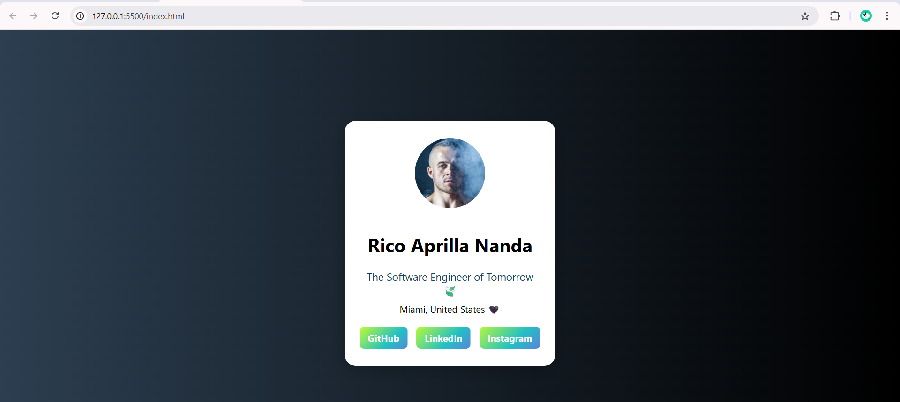

# Personal Profile Card 🌈🌼🌷

A responsive and animated personal profile card built using pure HTML and CSS.  
This project focuses on modern UI/UX styling, soft rainbow gradients, and elegant hover interactions.

## Technologies Used

- HTML5  
- CSS3 (Flexbox, Animations, Gradients)  
- Responsive Design  

## Features

- Animated rainbow gradient buttons  
- Clean layout with smooth hover effects  
- Responsive on mobile screens  
- Dark-to-light UI background transition  

## Screenshot

## Author

**Rico Aprilla Nanda**  
[LinkedIn](https://www.linkedin.com/in/rico-aprilla-n-3335a7251)  
[Instagram](https://www.instagram.com/ricoaprillananda)  
[GitHub](https://github.com/ricoaprillananda)

> “Design as if your interface is the only version of you the world will meet.”
